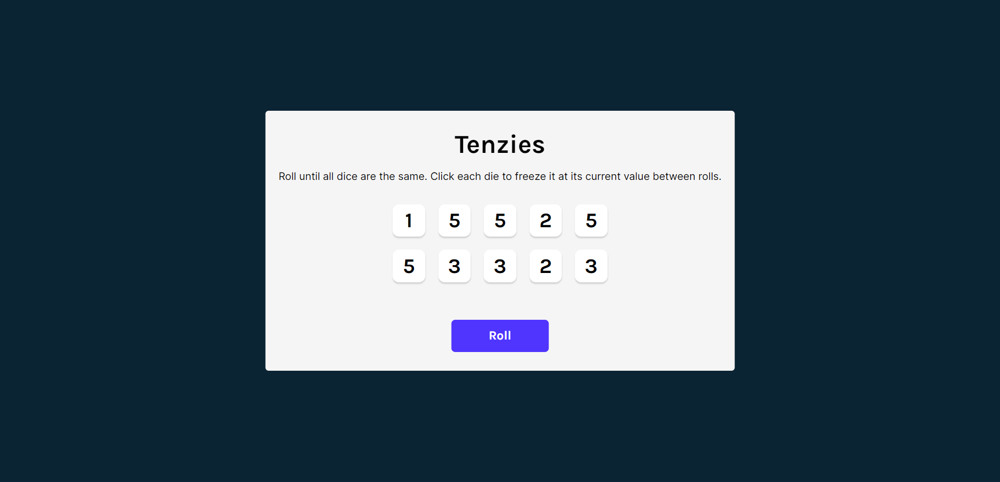
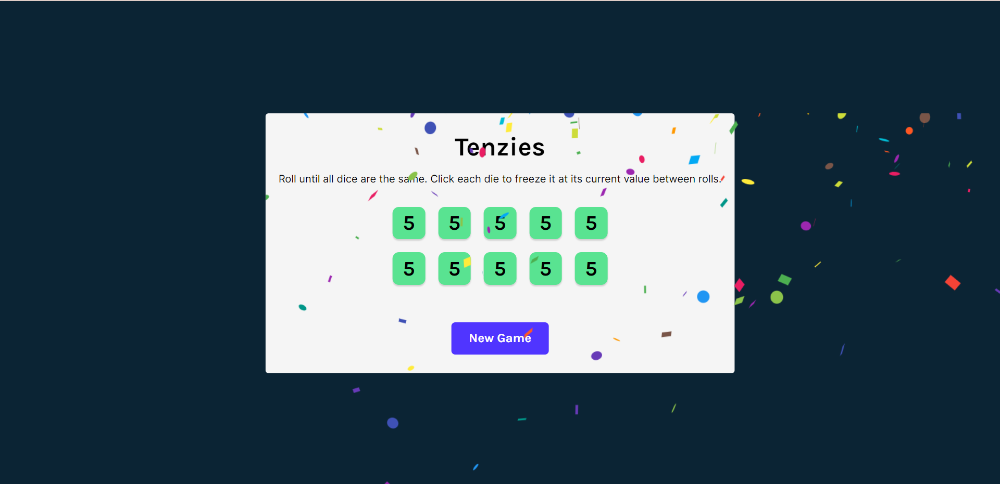

# Tenzies Game
This app allows users to play popular Tenzies game.

Deployed Link: https://tenzies01.netlify.app/
## Description
User can play Tenzies game by clicking the "Roll" button and holding the desired dice face by clicking on it to freeze it to its current state between rolls. The user wins when all the dice shows the same number. The game can be restarted by clicking the "Reset Game" button.

## My Contribution and Learnings
This project is build using Create React App environment. The entire JavaScript, HTML, and CSS code for this game is written by me. 